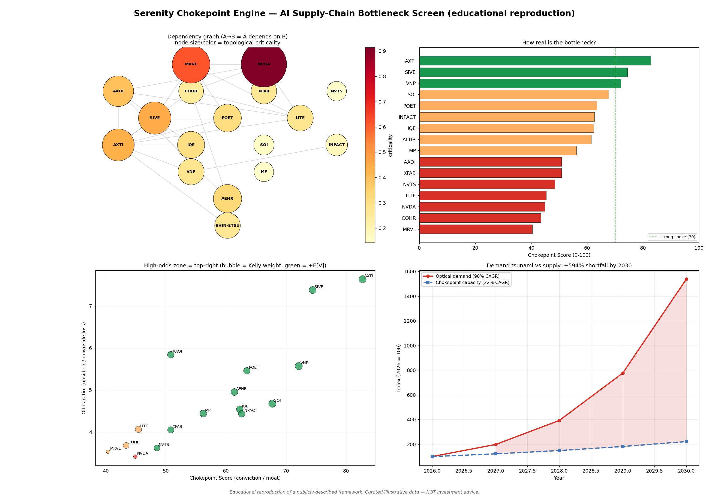
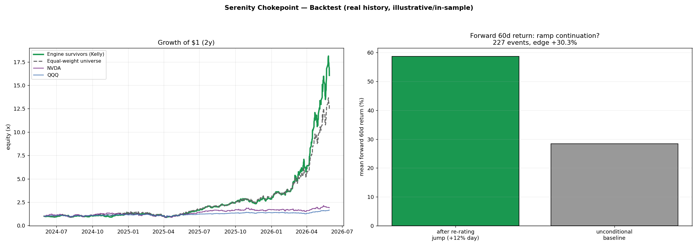
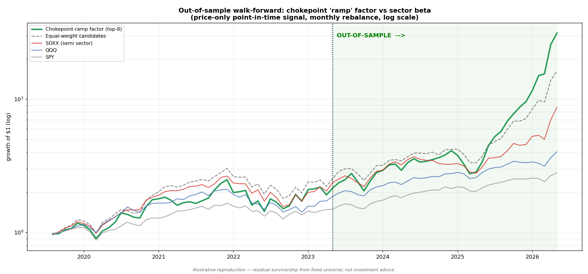
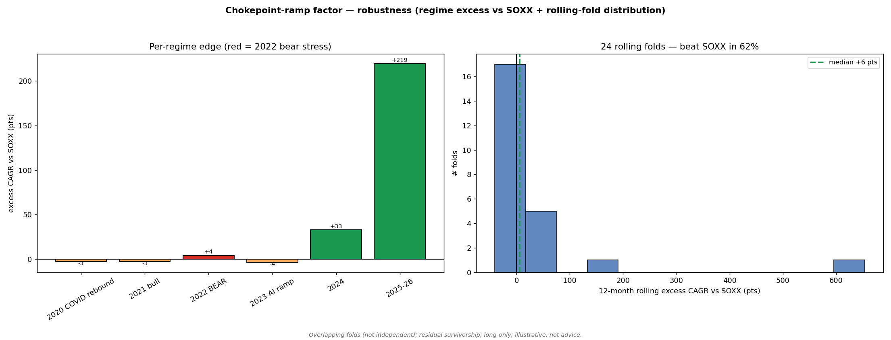

<div align="center">

# 🪢 Serenity Chokepoint Engine

### Don't buy the tuna. Buy the shiso leaf.

**An auditable, open-source reproduction of the AI supply-chain "Chokepoint Theory" — the framework behind one of the most talked-about retail traders of the decade.**

It reverse-engineers the AI-compute supply chain, hunts the physically irreplaceable bottlenecks the entire buildout *must* flow through, and builds a high-conviction stock pool that **maximises return under an as-certain-as-possible win rate.**

[](LICENSE)
[](https://www.python.org/)
[](tests/)
[](#-come-prove-us-wrong)
[](#%EF%B8%8F-read-this-first)

```bash
pipx install serenity-chokepoint
serenity pool
```

[中文说明](README.zh.md) · [Reproduce / Replace data](REPRODUCE.md) · [How it works](#-how-it-works) · [Performance](#-does-it-actually-work) · [Critique it](#-come-prove-us-wrong)

</div>

---

## ⚠️ Read this first

> This is an **educational reproduction** of a *publicly described* investment framework, built for people to **study and tear apart**.
>
> - 🧪 The bundled data are **illustrative placeholder estimates**, hand-assembled to demonstrate the *method* — **not a live signal**. Replace them with verifiable data (see [REPRODUCE.md](REPRODUCE.md)) before trusting any number.
> - 💸 **Nothing here is financial advice.** Small-cap, illiquid, highly volatile names. You can lose everything.
> - 🙅 **Not affiliated with, endorsed by, or connected to Serenity (@aleabitoreddit)** in any way. This is an independent reproduction of ideas they shared publicly.
> - 📈 The performance below comes from backtests with real, disclosed limitations (survivorship, a roaring AI bull market). We show you the unflattering parts on purpose.

If that's fine with you — welcome. Let's hunt chokepoints.

---

## 🍣 The idea in 30 seconds

In a piece of sushi, the tuna belly is the expensive part — but the **shiso leaf** is the one thing you cannot skip. The same is true of the AI boom.

Everyone owns the "tuna": NVIDIA, TSMC, the hyperscalers. The **alpha hides in the "shiso leaf"** — the tiny, overlooked, near-monopoly suppliers buried 4–7 layers deep in the supply chain, whose failure would halt the *entire* buildout.

> Just as ~20% of the world's oil must pass through the **Strait of Hormuz**, the photonics buildout must pass through a handful of indium-phosphide substrate, laser, and feedstock suppliers. Control the chokepoint, control the buildout.

A **chokepoint** is a node that is, all at once:

| 🔒 Concentrated | 🧱 Irreplaceable | ⏳ Qualification-gated | 🕵️ Undiscovered |
|---|---|---|---|
| Top 1–3 suppliers > 70% share | Material-science moat, no second source | 12–24 month design-in cycle | Small cap, low institutional ownership |

When demand grows at 50–100% CAGR and the choke can't, the screw gets repriced violently. That repricing is what the strategy is built to catch — **early, and only when the win is structurally likely.**

---

## ⚙️ The strategy, as one loop

```
   DEEP RESEARCH                CERTAINTY GATE                 RETURN MAXIMISER
 ┌────────────────┐         ┌──────────────────────┐       ┌────────────────────┐
 │ map the AI      │         │ keep only names whose │       │ among survivors,    │
 │ supply chain,   │  ────▶  │ win is structurally   │ ────▶ │ concentrate capital │
 │ score every     │         │ certain:              │       │ by win × upside so  │
 │ node's          │         │ • survives red-team   │       │ the pool MAXIMISES  │
 │ chokepoint-ness │         │ • win prob ≥ 60%      │       │ return GIVEN the    │
 │ + asymmetry     │         │ • chokepoint ≥ 60     │       │ win-rate holds      │
 │                 │         │ • P(EV>0) ≥ 60%       │       │ → CORE / BUILD /    │
 └────────────────┘         └──────────────────────┘       │   STARTER tiers     │
                                                            └────────────────────┘
```

It is **not** a multi-factor trading system. It does one thing: deep research → a high-conviction pool → maximise return under a win-rate condition.

---

## 🚀 Quickstart

```bash
# install once, get a global `serenity` command (like any CLI tool)
pipx install serenity-chokepoint        # or:  uvx serenity-chokepoint pool
                                         # or:  pip install serenity-chokepoint

serenity pool                            # 👈 the product: the stock pool
serenity pool --live                     # tighten it with live Yahoo Finance data
serenity validate AXTI                   # deep-dive one ticker (score + red-team)
serenity supply-chain                    # the 7-layer map + structural chokepoints
serenity backtest --oos                  # the honest out-of-sample test
serenity --help
```

<details>
<summary><b>📋 Sample <code>serenity pool</code> output</b> (click to expand)</summary>

```
SERENITY CHOKEPOINT — HIGH-CONVICTION STOCK POOL (deep research -> certainty gate -> max return)
Certainty gate: survives red-team + win_prob>=60% + chokepoint>=60 + P(EV>0)>=60%
Pool size: 8 names.   Objective: maximise return GIVEN the win-rate condition.

── TIER 1: CORE (highest conviction) ───────────────────────────────────────────
  SIVE   Sivers Semiconductors   L3 Laser / light source
         weight 23.2% | win 68%  P(EV>0) 100% | upside 5.0x  exp.return +253% | choke 74 resil 0.69
         thesis : CW laser light-source chokepoint for co-packaged optics; 2027-28 ramp; AVGO/MRVL buyout optionality.
         catalyst: UNDISCOVERED, MOAT:LONG-QUAL, M&A-TARGET | top risk: dilution / cash burn before ramp
  AXTI   AXT Inc.                L4 Substrate (InP/GaAs)
         weight 17.4% | win 72%  P(EV>0) 100% | upside 3.8x  exp.return +191% | choke 83 resil 0.77
         thesis : Western InP-substrate chokepoint ('Strait of Hormuz' of photonics); vertically integrated feedstock.
         catalyst: CONCENTRATED(>70%), MOAT:LONG-QUAL | top risk: China gallium/indium export controls
── TIER 2: BUILD ──  POET · AEHR · VNP
── TIER 3: STARTER / watch ──  IQE · INPACT · SOI

POOL BLEND: weighted win-prob 67%   weighted expected return +153% (per $1, on the modelled horizon)
```

</details>

---

## 🧠 How it works

Every node in the supply chain gets two things: a **Chokepoint Score** (is it a real bottleneck?) and an **asymmetric-payoff** estimate (is it a high-odds bet?).

### 1. Chokepoint Score (0–100) — six weighted pillars

| Pillar | Weight | What it captures |
|---|--:|---|
| **Supply concentration** | 22 | Top-3 share; > 70% is the hard gate, then curves up non-linearly |
| **Irreplaceability** | 22 | Material-science moat × qualification-cycle length |
| **Demand/supply gap** | 16 | AI end-market CAGR running ahead of the node's capacity CAGR |
| **Qualification barrier** | 16 | Already designed-in + long cert cycle = competitors years behind |
| **Information asymmetry** | 14 | Small cap + low institutional ownership + thin coverage (the alpha) |
| **Catalyst / optionality** | 10 | Insider buying, short interest, M&A premium, vertical integration |

### 2. Asymmetric payoff
The structural moat maps to a **win probability**; the ramp multiple (venture-style, not trailing P/S) maps to **upside**; dilution + valuation + tech-path + liquidity risk map to **downside**. Out come the **odds ratio**, **expected value**, and a deep-fractional-**Kelly** position size.

### 3. The supply-chain graph & demand model
A **NetworkX** dependency graph independently corroborates which nodes are chokepoints *topologically* (high betweenness / reverse-PageRank), and a simple compute-×-optical-intensity model sizes the demand-vs-capacity shortfall.

<div align="center"></div>

---

## 📊 Does it actually work?

Here's where most strategy repos show you a hockey stick and hide the caveats. **We built an engine to attack our own picks, and we publish the unflattering findings.** Read all three.

### 1️⃣ In-sample portfolio backtest (trailing 2y, real prices)

| Book | Return | CAGR | Sharpe |
|---|--:|--:|--:|
| **Chokepoint survivors (Kelly)** | **+1506%** | **58%** | **1.77** |
| Equal-weight universe | +1140% | 51% | 1.67 |
| 🐟 NVDA (the "tuna") | +91% | 11% | 0.53 |
| QQQ | +65% | 9% | 0.74 |

### 2️⃣ Event study — does "qualification → ramp" actually re-rate?
Using a **+12% single-day gap** as a proxy for a qualification/ramp event: the average **60-day forward return is +58.7% vs a +28.4% baseline → +30.3% edge** (227 events, 63% hit-rate). Re-rating events *continue*, they don't mean-revert. ✅

<div align="center"></div>

### 3️⃣ The honest one: genuine out-of-sample walk-forward
Broad fixed universe (winners **and** laggards), point-in-time price-only signal, train/test split, no look-ahead.

| Window | Strategy CAGR | SOXX CAGR | Verdict |
|---|--:|--:|---|
| **In-sample** (2019–23) | 22.2% | 25.2% | 🔴 *slightly LAGS* — proof it wasn't curve-fit |
| **Out-of-sample** (2023–26) | **143.9%** | 54.1% | 🟢 beats the **semiconductor sector itself** by +90 pts |

> The train window **underperforming** is the point: the out-of-sample edge can't be from tuning on the test data. And the benchmark is **SOXX** — so this is *selection within semis beating owning all semis*, not just sector beta.

<div align="center"></div>

### 🔬 ...and we stress-test that, too

<div align="center"></div>

- **2022 bear:** the factor fell **−30.9% vs SOXX −35.1%** — a +4.2pt cushion, no momentum crash. 🟢
- **Regime-dependent:** it *lagged* in the 2020/2021/2023 bull years; the edge is concentrated in **2024–26**, exactly the late volume-ramp phase the thesis is about. 🟡
- **Rolling 24 folds:** beats SOXX in **62%** of windows — but median Sharpe **1.01 vs SOXX 1.27**: higher return, **higher volatility**, edge in the right tail. It's a high-**odds** book, not a low-risk one. 🟡

**Bottom line:** the alpha looks real but **regime-dependent** and **volatile** — consistent with a concentrated, high-conviction, ride-the-ramp strategy. We'd rather you know that going in.

---

## 🥷 We attack our own thesis (the part we're proudest of)

The framework's own rule is: before you size up, hand the thesis to the harshest Devil's Advocate. So the engine ships with an **adversarial validator**:

```bash
serenity screen --live --adversarial
```

- **9 deterministic attack vectors** — valuation already priced-in, supply elasticity / second-source, CPO-vs-pluggables tech-path, "already discovered", dilution, microcap liquidity, customer concentration, geopolitics — each scored with a severity and a rebuttal.
- **Monte-Carlo** on the payoff assumptions → P(EV > 0).
- **Survival gate**: only names that survive the red-team make the pool.
- **Optional multi-LLM red-team** hook (GPT / Claude / Gemini), off by default.

On live data this correctly **kills** names the naive score would keep — e.g. a name trading at ~1677× EV/Sales, or one that's already 90%+ institutionally owned.

---

## 🧩 Architecture

```
serenity_chokepoint/
├── chokepoint_data.py   # curated universe of supply-chain nodes + attributes
├── scoring.py           # Chokepoint Score (0–100) + asymmetric-odds engine
├── supply_chain.py      # NetworkX dependency graph + topological chokepoints
├── demand_model.py      # AI-compute → optical-interconnect demand projection
├── adversarial.py       # Step-3 red/blue team + Monte-Carlo (+ optional LLMs)
├── live_data.py         # Yahoo Finance refresh of market-derived fields
├── backtest.py          # in-sample portfolio + factor + event study
├── oos_backtest.py      # out-of-sample walk-forward + regime/rolling robustness
├── pool.py              # THE PRODUCT: certainty-gated, return-maximising pool
└── cli.py               # the `serenity` command
```

Runs **fully offline** with zero API keys; `--live` is the only thing that touches the network.

---

## 🔁 Reproduce & replace the data

The bundled numbers are placeholders. [**REPRODUCE.md**](REPRODUCE.md) gives a per-field source table — which fields auto-refresh from market data and which need real research (top-3 share, qualification cycle, ramp multiple) — plus how to reproduce every chart and run the offline test suite:

```bash
pip install serenity-chokepoint[dev]
pytest -q          # 16 network-free tests pinning the engine's invariants
```

---

## 🤺 Come prove us wrong

This project exists **to be critiqued.** The most valuable contributions:

1. **Data** — overturn a node's chokepoint rating with real top-3 share / qualification facts.
2. **Scoring** — argue a pillar weight or curve is wrong.
3. **Odds model** — challenge the win-prob mapping, the up/down assumptions, the Kelly cap.
4. **Backtest** — find residual look-ahead/survivorship, or contribute a cleaner universe that includes delisted names.
5. **Attack vectors** — add a missing one (patent cliff, quantified customer concentration…).

Open an issue or a PR. Run `pytest -q` first. Be ruthless — that's the whole point.

---

## 🙏 Acknowledgments

- **Serenity (@aleabitoreddit)** — for sharing the Chokepoint Theory publicly. This is an independent reproduction; all errors are ours, not theirs.
- **[virattt/ai-hedge-fund](https://github.com/virattt/ai-hedge-fund)** (MIT) — the project this engine was first prototyped inside.
- The photonics / CPO research community (TrendForce, SemiAnalysis, Yole, and the public write-ups cited in [REPRODUCE.md](REPRODUCE.md)).

## 📄 License

MIT — see [LICENSE](LICENSE). Use it, fork it, break it. Just don't blame us for your trades.

<div align="center">

**⭐ If this made you think differently about the AI supply chain, star it — and then try to break it.**

</div>
